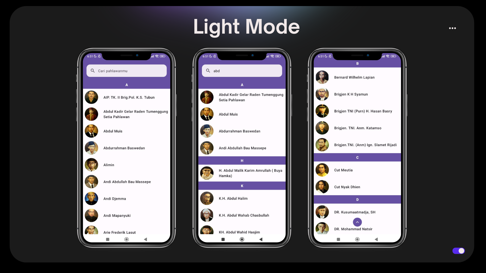
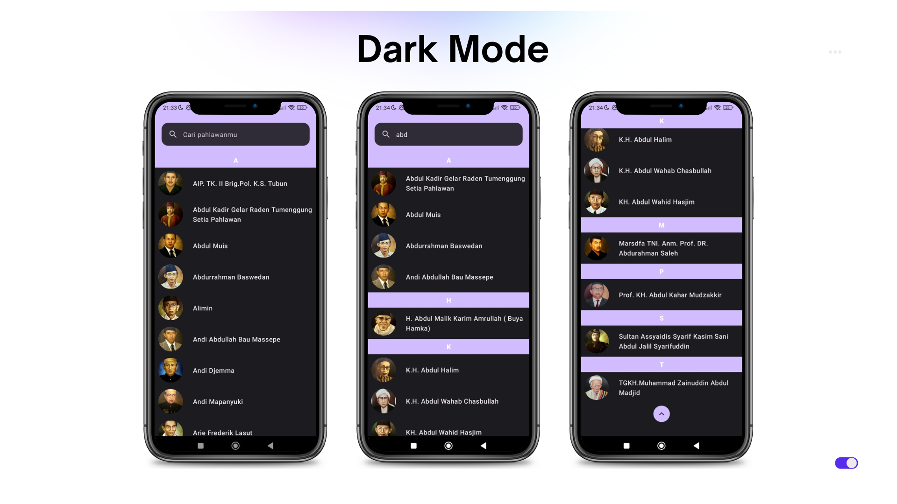

# JetHeroes
Heros App application is an application that contains a list of hero APIs. Here I apply pagination to reduce request data, a hero search feature, grouping heroes based on their first index letter, has a Button scroll to top feature. Here I use compose and also kotlin

## Preview 

     
      

